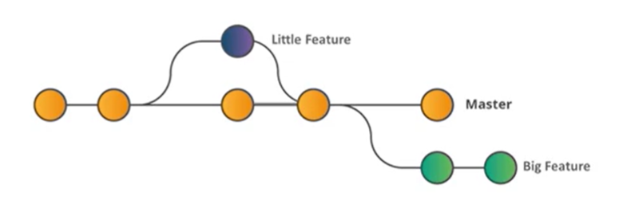

#### Introduction to Git

Git is a distributed version control system that tracks source code changes during software development. It allows multiple developers to work on a project simultaneously without interfering with each other’s work.

1) Most used Version Control System tool
2) Open Source project 
3) Distributed Version Control System
4) Integration with Software Tools like Jira

#### Lessons

1)  [Introduction](https://github.com/savanarohit/Git-Ninja/blob/main/01_Introduction.md)
2)  [Architecture](https://github.com/savanarohit/Git-Ninja/blob/main/02_Architecture.md)
3)  [Repositories](https://github.com/savanarohit/Git-Ninja/blob/main/03_Repositories.md)
4)  [Branching](https://github.com/savanarohit/Git-Ninja/blob/main/04_Branching.md)
5)  [Merging](https://github.com/savanarohit/Git-Ninja/blob/main/05_Merging.md)
6)  [Workflow](https://github.com/savanarohit/Git-Ninja/blob/main/06_Workflow.md)
7)  [Advance](https://github.com/savanarohit/Git-Ninja/blob/main/07_Advance.md)
8)  [Plugins](https://github.com/savanarohit/Git-Ninja/blob/main/08_Plugins.md)

